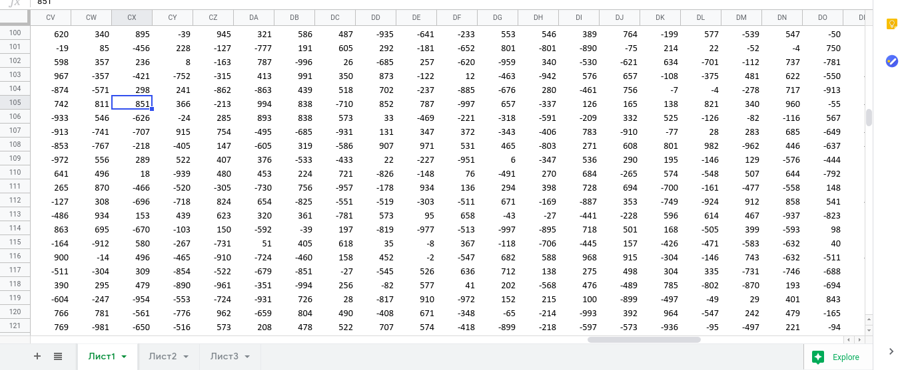
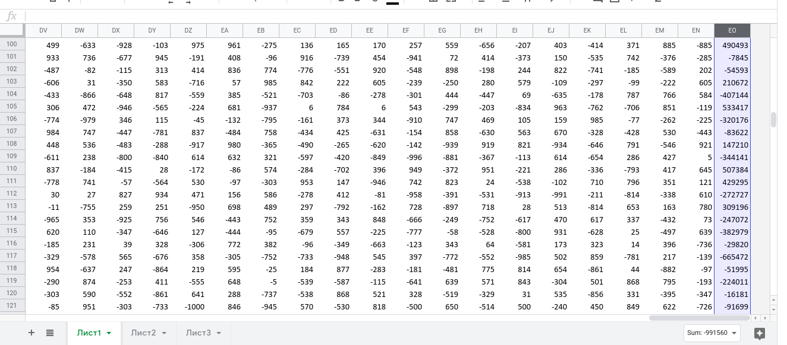
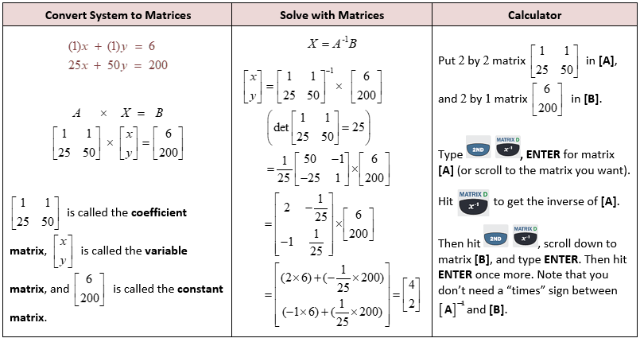

# Excellent Crackme
We know one can do pretty much everything in Excel spreadsheets, but this...

[excel_crackme](VolgaCTF_excel_crackme.xlsm)

Open the excel file:


Unzipping the xlsm file and decompiled the vba source code using `pcode2code`:
```
pcode2code xl/vbaProject.bin -o decompile
```
Analyse the code, only **VolgaCTF function** is important for finding the flag

```vb6
Private Sub VolgaCTF()
Dim input As String
Dim solution As Long
Dim number As Long
Dim answer As Long
input = Range("L15")  'L15 is the flag input box cell 
For i = 1 To Len(input) 'i will loop to 1 to length of input
	solution = 0
	For j = 1 To Len(input) 'j will loop to 1 to length of input
		'Get the value of cell and assign into number
		number = CInt(Cells(99 + i, 99 + j).Value)
		'Get a character from input from index j
		c = Mid(input, j, 1)
		'Add the number times the ASCII value of c to solution
		solution = solution + number * Asc(c)
	Next j
	'Get the value of cell and assign to answer
	answer = CLng(Cells(99 + i, 99 + Len(input) + 1).Value)
	'If answer not equal solution means wrong flag
	If (answer <> solution) Then
		MsgBox "Wrong Flag!"
		Exit Sub
	End If
Next i
'Only if all answer equal to all solution then the flag is correct
MsgBox "Congratz"
End Sub
```
After I reversing the code, immediately found a secret number table starts at (CV,100), because of `Cells(99 + i, 99 + j)` and `i` `j` starts at 1



It is a `45*46` table, and I notice last column of the table is quite large compared to other number:



After more deep analysing, I found these are **Simultaneous equations!**
```
Assume abcdefgh (unknown) is the input characters
First row:
620a +340b +895c -39d +945e +321f +586g +487h... = 490493
Second row:
-19a +85b -456c +228d -127e -777f +191g +605h... = -7845
etc
```
Therefore, the flag length must be 45 (45 column)

I decide to use `z3 solver` in python to solve this:
```py
from z3 import *
n = 45
inp = [Int('inp%i' %i) for i in range(n)]
numbers = [i.strip().split(" ") for i in open("numbers.txt",'r').read().split("\n")]
solver = Solver()
solver.add(inp[0] == ord("V"))
solver.add(inp[1] == ord("o"))
solver.add(inp[2] == ord("l"))
solver.add(inp[3] == ord("g"))
solver.add(inp[4] == ord("a"))
solver.add(inp[5] == ord("C"))
solver.add(inp[6] == ord("T"))
solver.add(inp[7] == ord("F"))
solver.add(inp[8] == ord("{"))
for i in range(9,45):
	solver.add(inp[i] >= 32)
	solver.add(inp[i] <= 126) 
solver.add(inp[44] == ord("}"))
for i in range(44):
	condition = ""
	for j in range(n):
		condition += "("+ numbers[i][j] + "* inp[%i])+" % j
	solver.add(eval(condition[:-1] + "==" + numbers[i][n]))
print(solver.check())
modl = solver.model()
print(''.join([chr(modl[inp[i]].as_long()) for i in range(n)]))
```
It took around 2 minutes to solve:
```
time python solve2.py
sat
VolgaCTF{7h3_M057_M47h_cr4ckM3_y0u_3V3R_533N}

real	1m41.494s
user	1m41.331s
sys	0m0.095s
```
## Flag
```
VolgaCTF{7h3_M057_M47h_cr4ckM3_y0u_3V3R_533N}
```

## Better Solution
After the CTF ends, I saw better solution that can solve faster:


That is use matrix to solve like the picture below:


[Unhappi writeups](https://ilovectf.github.io/jekyll/update/2020/03/29/Volga.html#excellent-crackme-150-points)